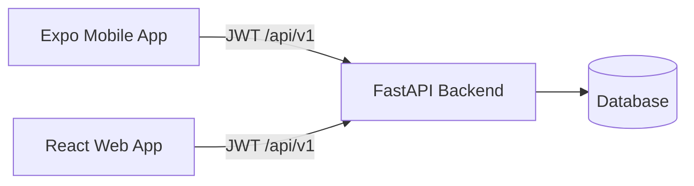

# Related repositories

This mobile template is one part of a three-repo starter kit from MobiTrendz.

## FastAPI Backend Template

**Repository:** [MobiTrendz FastAPI Backend Template](https://github.com/mobitrendz/fastapi-backend-template)

- REST API with `/api/v1` prefix
- JWT authentication (OAuth2 password flow)
- User roles: `user`, `admin`, `super`
- Todo CRUD, user management, Prometheus metrics
- OpenAPI spec consumed by this mobile app (`openapi.json`)

### Default production URL

MobiTrendz hosts the demo API at:

```
https://mobitrendz.onrender.com/
```

## React Frontend Template

**Repository:** [MobiTrendz React Frontend Template](https://github.com/mobitrendz/react-frontend-template)

- React 19 + Vite + Tailwind CSS
- Same API and error format as the mobile app
- Web UI for admin/user workflows

## This repository (Expo Mobile)

- **Audience:** Regular `user` role only
- **Platform:** iOS, Android (and optional web via Expo)
- **API client:** Generated from the same OpenAPI spec as the web frontend

## How they connect



## Keeping specs in sync

1. Export or copy OpenAPI JSON from the backend.
2. Replace `openapi.json` in this repo.
3. Run `npm run generate-api`.
4. Update the web frontend's spec the same way.

## Choosing the right client

| Need | Use |
|------|-----|
| Mobile users, todos on the go | This Expo template |
| Admin dashboards, bulk management | React frontend |
| API, auth, data model | FastAPI backend |
