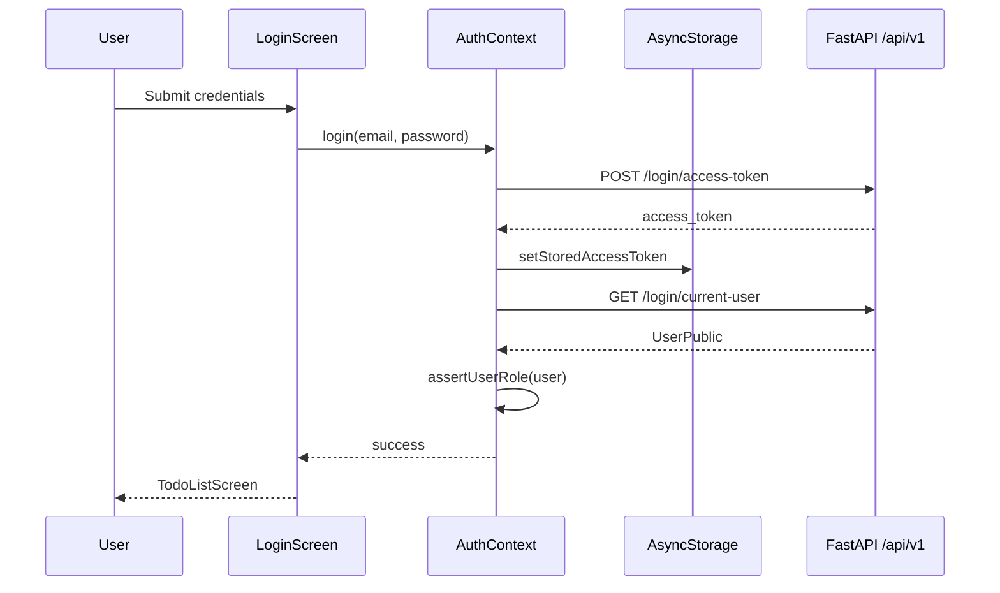

# Authentication

The app uses JWT bearer tokens issued by the FastAPI backend. Sessions persist across app restarts via AsyncStorage.

## User flows

### Sign in

1. Enter email and password on `LoginScreen`.
2. App calls `POST /api/v1/login/access-token` with `username` (email) and `password`.
3. On success, the `access_token` is stored and attached to subsequent requests.
4. App fetches `GET /api/v1/login/current-user` to populate the session.

### Sign up

1. Switch to **Create account** on the login screen.
2. Provide full name, email, and password.
3. App calls `POST /api/v1/login/signup`, then automatically signs in.

### Sign out

Available from the profile screen. Clears AsyncStorage and in-memory token.

### Session restore

On launch, `AuthProvider` reads the stored token, sets it on the HTTP client, and validates it by fetching the current user. Invalid or expired tokens are cleared silently.

## Role restriction

Only users with `role: "user"` may use this app. Admin and super-user accounts receive an error after a successful token exchange:

```
This app is for regular users only. Admin and super user accounts cannot sign in here.
```

Implementation in `src/context/AuthContext.tsx`:

```typescript
const USER_ROLE = 'user' as const;

function assertUserRole(user: UserPublic) {
  if (user.role !== USER_ROLE) {
    throw new Error(
      'This app is for regular users only. Admin and super user accounts cannot sign in here.',
    );
  }
}
```

If a restricted role signs in, the token is immediately cleared.

## Key files

| File | Responsibility |
|------|----------------|
| `src/context/AuthContext.tsx` | Auth state, login/signup/logout, session restore |
| `src/lib/auth-storage.ts` | Persist JWT in AsyncStorage (`access_token` key) |
| `src/api/client.ts` | Inject bearer token on every request |
| `src/screens/LoginScreen.tsx` | Login and signup UI |
| `src/lib/api-error.ts` | User-friendly error messages |

## Token storage

```typescript title="src/lib/auth-storage.ts"
const ACCESS_TOKEN_KEY = 'access_token';

export async function getStoredAccessToken(): Promise<string | null> {
  return AsyncStorage.getItem(ACCESS_TOKEN_KEY);
}
```

## HTTP client auth hook

```typescript title="src/api/client.ts"
let accessToken: string | undefined;

export function setAccessToken(token: string | undefined) {
  accessToken = token;
}

client.setConfig({
  baseUrl: API_BASE_URL,
  auth: async () => accessToken,
});
```

## Auth context API

Use `useAuth()` in any screen inside `AuthProvider`:

| Member | Type | Description |
|--------|------|-------------|
| `user` | `UserPublic \| null` | Current user profile |
| `isLoading` | `boolean` | `true` during initial session restore |
| `login` | `(email, password) => Promise<void>` | Sign in |
| `signup` | `(email, password, fullName) => Promise<void>` | Register then sign in |
| `logout` | `() => Promise<void>` | Clear session |
| `refreshUser` | `() => Promise<void>` | Re-fetch current user |

## Sequence diagram



## Error handling

Login failures use `getApiErrorMessage()` to surface backend `detail` strings or validation errors. Network failures include the configured `API_BASE_URL` so you can verify connectivity.
