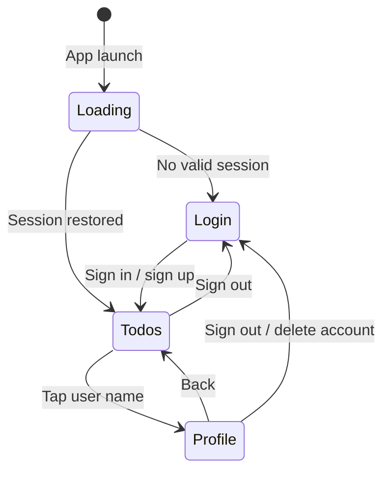

# Guides

These guides describe how each major feature works in the app — both from a user perspective and how the implementation is structured.

| Guide | Topics |
|-------|--------|
| [Authentication](./authentication.md) | Sign in, sign up, JWT storage, role checks |
| [Task management](./tasks.md) | CRUD, modals, date pickers, status cycling |
| [Profile](./profile.md) | Edit details, password, account deletion |

## Navigation model

The app uses a simple screen state in `App.tsx` — no React Navigation library:

