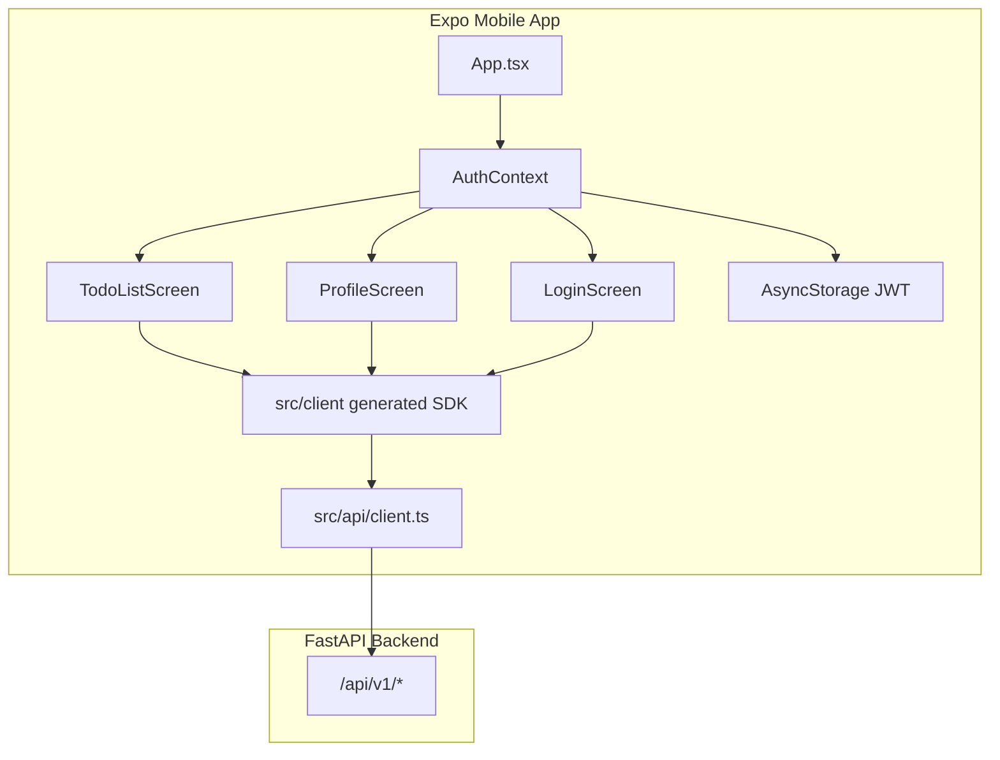

# Introduction

**Expo Mobile Template** is a React Native mobile app built with [Expo SDK 54](https://docs.expo.dev/versions/v54.0.0/) that connects to the [MobiTrendz FastAPI Backend Template](https://github.com/mobitrendz/fastapi-backend-template). It provides user authentication, a full-featured todo/task manager, and a profile screen for account management.

Part of the **MobiTrendz** starter kit with the [React web frontend](https://github.com/mobitrendz/react-frontend-template).

The app is intended for **regular user accounts only** — `admin` and `super` roles are rejected at sign-in.

## What you can do

| Area | Capabilities |
|------|----------------|
| **Authentication** | Sign in, sign up, JWT session restore, sign out |
| **Tasks** | Create, edit, delete, status cycling, due dates, priorities |
| **Profile** | Edit name/email, change password, delete account |

## Tech stack

| Layer | Technology |
|-------|------------|
| Framework | Expo ~54, React Native 0.81, React 19 |
| Language | TypeScript |
| API client | [@hey-api/openapi-ts](https://heyapi.dev/) |
| HTTP | `@hey-api/client-fetch` |
| Storage | `@react-native-async-storage/async-storage` |
| Date picker | `@react-native-community/datetimepicker` |
| Backend | REST API with `/api/v1` prefix |

## Architecture overview



## Documentation map

| Section | Description |
|---------|-------------|
| [Getting started](./getting-started/index.md) | Install, configure API URL, run the app |
| [Guides](./guides/index.md) | Authentication, tasks, and profile usage |
| [Development](./development/index.md) | Project layout, API client, native builds |
| [Reference](./reference/app-config.md) | `app.json` settings and troubleshooting |
| [Ecosystem](./ecosystem/related-repos.md) | Related backend and web frontend repos |

## Quick start

```bash
git clone <repository-url>
cd expo-mobile-template
npm install
npm start
```

Set your backend URL in `app.json` under `expo.extra.apiUrl` before running on a device. See [Configuration](./getting-started/configuration.md) for environment-specific URLs.
